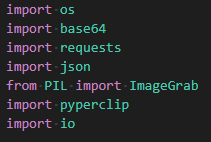
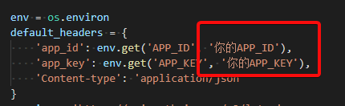
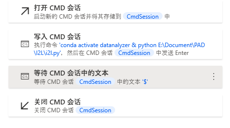
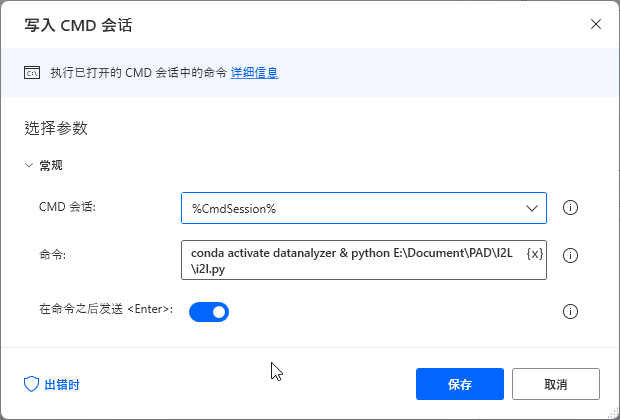
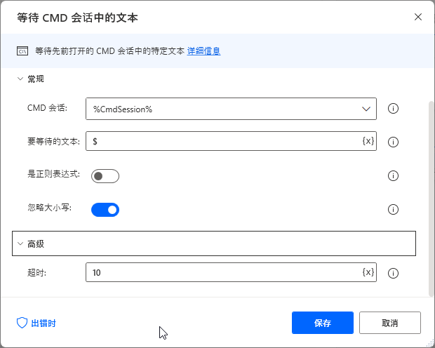
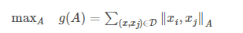
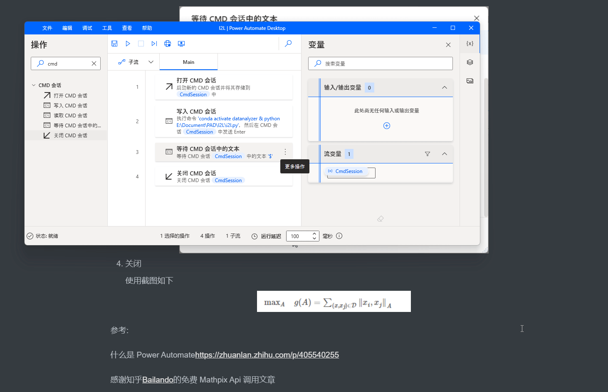

mathpix ocr 识别

Win11带来了PowerAutoMate桌面版(PAM)和苹果捷径/小爱捷径等是一致的低代码平台

所以做个demo试试(又不是不能用.jpg) 

第一步 安装miniconda或anaconda

第二步 安装脚本相关依赖

注：PIL为pip install pillow

填入mathpix api 在cmd中进行调用看是否成功

其实到这，只要你修改目录下的run.bat

为conda activate 你的环境 & python 你的目录\i2l.py

截图到剪贴板-双击运行-脚本输出公式 就可以粘贴latex公式了

为啥还怎么麻烦呢 =-=

第三步 配置PAM开始调用（等待流程定义）（希望后续能推出调用快捷键）

1. 打开会话（PAM里面拖拉拽）

2. 写入（PAM里面拖拉拽），后填入conda activate 你的环境 & python 你的目录\i2l.py

	

3. 等待（PAM里面拖拉拽），这是等待CMD执行完毕，由于我是用的公式图片转latex，所以命令行最后输出的

	\$公式\$

	这种形式，所以就设置为\$

	超时按照你的想法自己自行设置

	

4. 关闭

	使用截图如下

	

	$\operatorname { max } _ { A } \quad g ( A ) = \sum _ { ( x , x _ { j } ) \in D } \| x _ { i } , x _ { j } \| _ { A }$

	

所以后续使用是 截图到剪贴板 - PAM运行 - 粘贴

参考:

什么是 Power Automatehttps://zhuanlan.zhihu.com/p/405540255

感谢知乎[Bailando](https://www.zhihu.com/people/yu-chang-xin-66)的免费 Mathpix Api 调用文章 对原脚本增加了自动复制到剪贴板

